  
.t1[Projektmanagement]
   
.t3[Ausarbeitung zu:]

.center[Projektorganisation und Management im Software Engineering, Manfred Broy & Marco Kuhrmann]

.center-small[ergänzt durch]

.center[Projektmanagement im Studium, Claudia Stöhler]

.center-small[und]

.center[IT-Projektmanagement, Christian Aichele & Marius Schönberger]
  
.center-small[Bastian Schneider • Luca Berneking • Felix Tanner • Markus Schuler]
.center-small[Michelle Vorwerk • Sinan Yasar • Leon Brandt]

---

     
.t-big[Einleitung]

---

# Ziele
- effiziente und kostengünstige Entwicklung von Software mit hoher Qualität
- Zeit, Kosten, Qualität, Umfang
- sind voneinander abhängig
---

## Magisches Dreieck, Teufelsquadrat

Quelle: Projektorganisation und Management im Software Engineering, Manfred Broy & Marco Kuhrmann (S. 15)
---

# Besonderheiten
- kein Produktions- bzw. Fertigungsprozess im üblichen Sinne
- Produkt (Software) für Laien sehr abstrakt und wenig anschaulich
- Vertrieb und Wartung sind einzigartig
- erfordert umfassendes Wissen des Anwendungsfeldes
- Chancen und Risiken durch frühe Kundeneinbindung
- ständige, schnelle Weiterentwicklung der Branche
---

# Herausforderungen
- Methoden können nicht mithalten
- Personalkosten schwer einzuschätzen
- Kosten und Aufwand sind trotz Frameworks etc. unverändert
- häufige Anforderungsänderungen
- Kosten und Aufwand bei Fehlern und Bugs sind exponenetiell
---

# Erfolgsfaktoren
- Motivation, (Aus-)Bildungsgrad, Teamfähigkeit von Mitarbeitern
- Kundenorientierung
- Prozessorientierung
- Ergebnisorientierung
- Modularisierung und Wiederverwendung
---

# Prinzipien
- klare Ziele setzen
- realistische Pläne anfertigen
- Miteinbeziehen von relevanten Interessengruppen
- Verantwortungsstrukturen sollten klar geregelt und durchschaubar sein
- Entscheidungsbefugnisse definieren
- Entscheidungsprozesse festlegen und transparent gestalten
- unabhängige Kontrollinstanzen für Qualitäts- und Fortschrittssicherung
- offene Kommunikation und festgelegte Schnittstellen
- Mitarbeiter sollten motiviert und gut (aus-)gebildet sein
- gute Arbeitsbedingungen und -umgebung
- Projektmanager und Entwickler sollten erfahren sein
---

# Inhalt
1. Einleitung
2. Projekt-/Produktlebenszyklus
3. Projektentstehung
4. Projektorganisation
5. Vorgehensmodelle
6. Projektfortschrittskontrolle-/Steuerung
7. Qualitätskontrolle-/Steuerung
8. Projektabschluss

---

     
.t-big[Projekt-/Produktlebenszyklus]

---

## Projektlebenszyklus
* 4 Phasen
	- Projektentstehung
	- Projektdefinition
	- Projektdurchführung
	- Projektabschluss
* Übergreifende Aufgaben
* Knowledge Management
## Produktlebenszyklus
* startet bei der Planung
* endet bei der Stilllegung
---

---

## Phasen der Softwareentwicklung
* Ressourcen
	- Personal
	- Werkzeuge
	- Räumlichkeiten
	- Finanzbudgets
	- Rahmenbedingungen
* Vorgaben
	- Verträge
	- Anforderungen
	- Terminplan
	- Budgetplan
	- Qualitätsvorgaben
	- Vorgaben zur Verantwortungsaufteilung
---

---

## Erfassung und Verfeinerung der Anforderungen
* neue Anforderungen
* Verfeinerung der groben Anforderungen
* Verfeinerung des Projektplans
## Systementwurf
* Planungsphase
* Architektur wird festgelegt
* Planung der Qualitätssicherung
## Implementierung, Verifikation und Test
* Projektteam erstellt Code
* Leitung koordiniert
* nicht zu früh starten
---

## Test und Integration
* System wird zusammengesetzt
* Software wird getestet
## Erprobung und Übergabe
* Übergabe an den Kunden findet statt
* Prototyp
* Weiterentwicklung und Wartung (sechste Phase)
---

---

     
.t-big[Projektentstehung]

---

# Weiteres Vorgehen

- Kundenbeziehung aufbauen
- Änderungswünsche umsetzen
- Informationsauskunft

### Letter of Intent

- Absichtserklärung
- Ermöglicht früheren Projektstart
---

# Vertragsinhalte

- **Leistungen**: Funktionsumfang, Termine, Qualitätsanforderungen, Preise, Abnahme
  
- **Gewährleistungen**: Haftungsvereinbarungen
  
- **Nutzungsrechte**: Urheberrechte, Rechte am Weitervertrieb
  
- **Gesetzliche Vorschriften**: z.B. ISO-Zertifizierungen
---

# Vertragsformen

### Werksvertrag

- Auftragnehmer schuldet dem Auftraggeber das fertige Projektergebnis
- Kostenrisiko beim Auftragnehmer

### Dienstleistungsvertrag

- Abrechnung nach Aufwand
- Kostenrisiko beim Auftraggeber
---

# Spezielle Projektkonstellationen

### Eigenentwicklungen

- kein richtiger Vertrag notwending
- Sinnvoll zur internen Zeit und Kostenplanung

### Agiles Projekt

- Projekt ändert sich während der Durchführung
- schwierig in einen klassischen Vertrag zu bringen
---

# Ablauf

---

# Aufwandsschätzung

### Auftraggeber

- Welche Kosten sind angemessen?
- Erforderliches Budget festlegen

### Auftragnehmer

- Ist das Projekt wirtschaftlich?
- Vorgabe für die Zeit und Projektmittel Planung
---

# Vorgehensweisen

### Aktivitätsorientiert

- Unterteilung in Vorgehenspakete
- Festlegen von Abhängigkeiten

### Artefaktorientiert

- Schätzung der einzelnen Artefakte
- Softwarekomponenten, Dokumentationen und Schulungen
---

# Prinzipien

- Dokumentieren des Vorgehens und der Ergebnisse
- Alle Mitarbeiter werden einbezogen
- Messung in Aufwandseinheiten
- Kontinuierliche Kontrolle der Schätzungen am Projektstatus
---

# Expertenschätzungen

- Experten stellen Fragen
- Durchführung
- Erläuterung der Schätzung
- Mehrere Iterationen möglich

### Variationen

- **Schätzklausur**: Verhandlung zwischen den Experten
- **Delphi-Methode**: Diskusion von Gründen der Abweichungen
- **Planing-Poker**: Schätzungen der Teilnehmer werden zunächst verdeckt getätigt
---

# Berechnung

- optimistische Schätzung (best case, **bc**)
- pessimistische Schätzung (worst case, **wc**)
- wahrscheinliche Schätzung (most likely case, **lc**)

### Drei-Zeiten-Methode

- A = (bc + 4 * lc + wc)/6
---

# Angebots-/Vertragswesen

### Proaktiv
- Produkte oder Dienstleistungen werden aktiv angeboten

### Reaktiv
- Reagieren auf Ausschreibungen von Auftraggebern
---

# Inhalt des Angebotes

- Vertriebliche Bestandteile
- Lösungsbestandteile
- Kaufmännische Bestandteile
- Vertragsbestandteile
- Projektplan
  - Zeitplan
  - Meilensteine
  - Aufwand und Kosten
  - Ressourcen
---

     
.t-big[Projektorganisation]

---

### Projektstrukturplan

- besserer Überblick
- kleinere Arbeitspakete/Teilprojekte

---

### Projektstrukturplan - Erstellung
#### Top-Down

- gesamte Problemstellung
- schrittweise zerlegt
- vorher Strukturierungskriterien festlegen

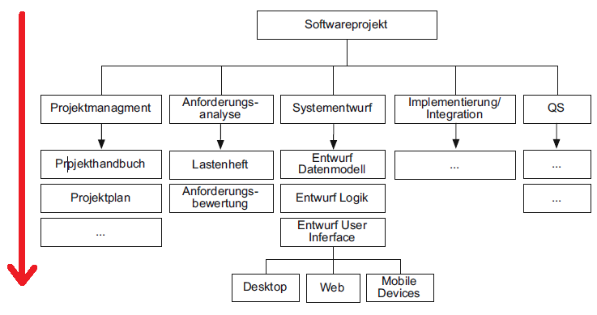

---

### Projektstrukturplan - Erstellung
#### Bottom-Up

- Brainstorming aller Einzelaktivitäten
- unten nach oben

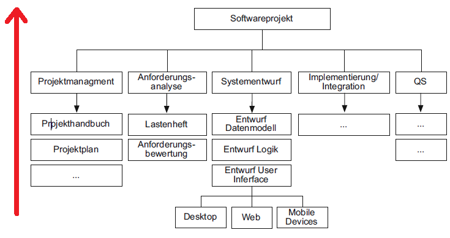

---

### Projektstrukturplan - Überprüfung
#### Disjunktionsbedingung

- Elemente einer Ebene
- vollständig unterscheiden

---

### Projektstrukturplan - Überprüfung
#### Vollständigkeitsbedingung

- Inhalt der zerlegten Elemente
- zusammen Ursprungselement

---

### Projektstrukturplan
#### Strukturierungskriterien

Gliederung nach:
- Disziplinen
- Architektur
- Aufbau der Software
- Verantwortung

---

### Projektstrukturplan
#### Arbeitspakete

Arbeitspakete = durchzuführende Arbeit

- festgelegte Dauer
- Zuordnung von Personal- & Betriebsmittel
- Abhängigkeiten zu anderen Arbeitspaketen

Zustände:
- Vorgeschlagen
- Aktiv
- in Bearbeitung
- Abgeschlossen
- Erledigt

---

### Meilensteinplan

- Kontrolle
  - Projektfortschritt
  - Qualität

- Erreichen der Meilensteine
  - Qualität prüfen & dokumentieren

---

### Meilensteinplan - Meilenstein

Meilenstein = zu erreichender Entwicklungsstand / Zwischenziel

- überprüfbar beschrieben (nicht erlaubt "Programm zu 90% fertig")
- kurze Dauer (2 - 4 Wochen)
- regelmäßig kontrollieren
  - wenn Meilenstein erreicht, Artefakte überprüfen

#### Blockierende Meilensteine
- sind von Entscheidungen abhängig
- beeinflussen Projektablauf

Beispiel:
- Projekt genehmigt
- Anforderungen festgelegt
- Projekt beauftragt
- Abnahme erfolgt

---

### Meilensteinplan - Eigenschaften

- Überprüfbarkeit
  - Erreichen eines Meilensteins -> min. ein Artefakt abgeschlossen
- Kurzfristigkeit
  - Abstände zwischen Meilensteinen kurz (ca. 3 - 4 Wochen)
- Gleichverteilung
  - Meilensteine gleichmäßig verteilen

---

# Organisationsformen
- Wahl der Organisationsform
- Linienorganisation
- Matrixorganisation
- Multiprojektorganisation
---

### Netzplantechnik
- Grobplanung
- Berechnung von Zeitpunkten
  - Mindestdauer
  - Verzögerung von Arbeitspaketen
  - Projekt im Zeitplan
  - früher oder später fertig

---

### Netzplantechnik - Darstellung
#### MPM-Netzplan

- Standard Netzplan
- Knoten -> Vorgänge
- Pfeile -> Abhängigkeiten

---

### Netzplantechnik - Darstellung
#### Vorgangspfeil-Netzplan (CPM-Netzplan)

- Knoten -> Abhängigkeiten (Anfang/Enderereigniss)
- Pfeile -> Vorgänge

---

### Netzplantechnik - Darstellung
#### Ereignissknoten-Netzplan (PERT-Netzplan)

- Knoten -> Ereignisse
- Pfeile -> Abhängigkeiten
- Dauer Tätigkeit
  - nicht fix
  - frühste und späteste Termine

---

### Netzplantechnik - Kritische Pfade und Optimierung
- Optimierungsziel
- Aufwand klein
- Entwicklungsdauer mit max. Aufwand klein

#### Kritischer Pfad
- Vorgänge
- zeitliche Änderung
- Endtermin verschieben

min. ein kritischer Pfad

---

### Netzplantechnik - Kritische Pfade und Optimierung

#### Probleme in der Anwendung
- Randbedingungen
  - Ausgleich schwer zu berücksichtigen
- Abhängigkeiten
  - nicht immer feste Abhängigkeiten
  - Präzision, die möglicherweise nicht da ist
- Detailierungsgrad
  - Teilaufgaben vorziehen -> Untergliederung des Projekts
  - Netzplan nicht sinnvoll anwendbar

---

### Balkenplantechnik

- Projektstrukturplan
  - Abhängigkeiten der Arbeitspakete
- Nachteil Netzplänen
  - parallele Arbeitspakete nicht darstellbar

Lösung: **Gantt-Diagramm**

---

### Balkenplantechnik - Gantt-Diagramm
- **Zeiten und Dauer** auf Zeitachse
- **Vorgänge** in erste Spalte
- **Zeitachse** in erster Zeile
- **Vorgänge** als Balken

#### Vernetzte und unvernetzte Gantt-Diagramme
- alle Vorgänge eingetragen
- keine Abhängigkeiten
- Abhängigkeiten später definiert & eingetragen

---

### Balkenplantechnik - Beziehungen und Abhängigkeiten
#### Normalfolge
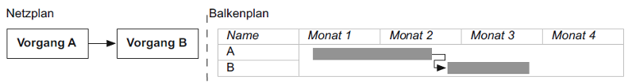

#### Anfangsfolge
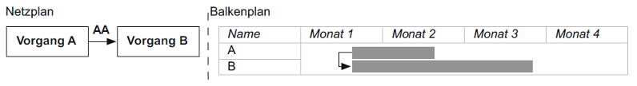

---

#### Endfolge
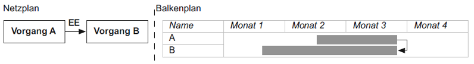

#### Sprungfolge

---

## Linienorganisation

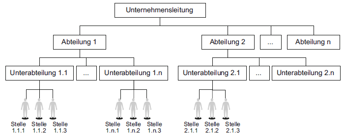
Quelle: Projektorganisation und Management im Software Engineering, Manfred Broy & Marco Kuhrmann (S. 37)

---

## Philosophien zur Projektplanung

### Meilenstein-orientierte Planung
- Meilensteine einfach erkennbar
- nicht zeitlich fixiert
- variable Elemente

### Fast Tracking
- meilensteinorientiert
- paralleles Arbeiten
- V-Modell
- Artefakte
  - spätestens fertiggestellt
  - qualitätsgesichert
  - Abhängigkeiten

---

## Philosophien zur Projektplanung

### Time Boxing
- Zeitpunkte für Überprüfung
- Extremfall Planung nach hinten verschieben
- Umfang oder Qualität angepasst

---

# Aspekte von Projekt-/Arbeitsplanung in Projektmanagementwerkzeugen
- Hauptaspekt vieler Projektmanagementwerkzeugen: Abbildung von Arbeitspaketen in "*Tasks*" / "*Issues*" und Zusammenfassen dieser in "*Milestones*"

## Betrachtung dieses Features in verschiedenen Projektmanagementwerkzeugen:
- **Github** (Git-Implementierung mit Projektmanagementansätzen)
- **Gitlab** (Git-Implementierung mit Projektmanagementansätzen)
- **Trello** (Simples Projektmanagementwerkzeug auf Kanban-Board-Basis; gut Integrierbar)
- **Jira** (Dedizierte Projektmanagementsoftware)
- **MS-Project** (Dedizierte Projektmanagementsoftware)

---

# Github
- Ermöglicht das Erstellen von "*Issues*"

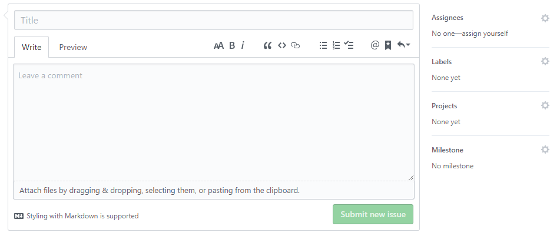

---

# Github

Funktionalität | Github
--- | ---
Arbeitspakete | ✔
Zusammenfassen in Milestones | ✔
Labeling | ✔
Checklisten | ✔
Diskussion | ✔

---

# Gitlab
- Erweitert die Funktionen von **Github** um z.B. Timetracking

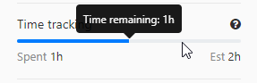

---

# Gitlab

Funktionalität | Gitlab
--- | ---
Arbeitspakete | ✔
Zusammenfassen in Milestones | ✔
Labeling | ✔
**Zeitplanung (Due-Date)** | **✔**
**Timetracking (inkl. Schätzung)** | **✔**
Checklisten | ✔
Diskussion | ✔

---

# Trello
- Ermöglicht ebenfalls das Erstellen von "*Cards*" (= Arbeitspaket / Issue)

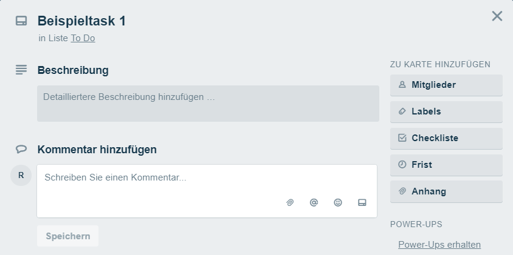

---

# Trello

Funktionalität | Trello
--- | ---
Arbeitspakete | ✔
Zusammenfassen in Milestones | ✔
Labeling | ✔
Zeitplanung (Due-Date) | ✔
Timetracking (inkl. Schätzung) | 🗙
Checklisten | ✔
Diskussion | ✔

---

# Jira

- Bietet alle Features vorhergehender Werkzeuge und ergänzt um die Möglichlichkeit Issues zu priorisieren

---

## Matrixorganisation

Quelle: Projektorganisation und Management im Software Engineering, Manfred Broy & Marco Kuhrmann (S. 39)

---

# Jira

Funktionalität | Jira
--- | ---
Arbeitspakete | ✔
Zusammenfassen in Milestones | ✔
Labeling | ✔
**Priorisierung** | **✔**
Zeitplanung (Due-Date) | ✔
Timetracking (inkl. Schätzung) | ✔
Checklisten | ✔
Diskussion | ✔

---

# MS-Project

- Erweitert um das Feature, Tasks in Abhängigkeit zu setzen und Ressourcen zu verwalten und zuzuweisen.
- Ressource = Person, Material, Ausrüstung, usw.

- Ermöglicht später z.B. das Erzeugen umfangreicher Berichte

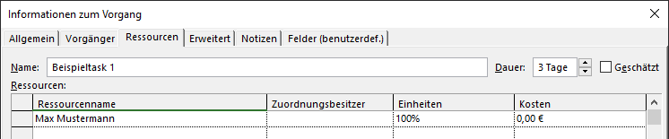

---

# MS-Project

Funktionalität | MS-Project
--- | ---
Arbeitspakete | ✔
Zusammenfassen in Milestones | ✔
Labeling | 🗙
Priorisierung | ✔
Zeitplanung (Due-Date) | ✔
Timetracking (inkl. Schätzung) | ✔
Checklisten | 🗙
Diskussion | 🗙
**Abhängigkeiten** | **✔**
**Ressourcenmanagement** | **✔**

---

# Überblick

Vergleich von Projektmanagementwerkzeugen im Bezug auf Arbeitspakete

Funktionalität | Github | Gitlab | Trello | Jira | MS-Project
--- | --- | --- | --- | --- | ---
Arbeitspakete | ✔ | ✔ | ✔ | ✔ | ✔
Zusammenfassen in Milestones | ✔ | ✔ | ✔ | ✔ | ✔
Labeling | ✔ | ✔ | ✔ | ✔ | 🗙
Priorisierung | über Labels | über Labels | über Labels | ✔ | ✔
Zeitplanung (Due-Date) | 🗙 | ✔ | ✔ | ✔ | ✔
Timetracking (inkl. Schätzung) | 🗙 | ✔ | 🗙 | ✔ | ✔
Checklisten | ✔ | ✔ | ✔ | ✔ | 🗙
Diskussion | ✔ | ✔ | ✔ | ✔ | 🗙
Abhängigkeiten | 🗙 | 🗙 | 🗙 | über Sub-Tasks | ✔
Ressourcenmanagement | 🗙 | 🗙 | 🗙 | 🗙 | ✔

---

# Darstellung von Arbeitspaketen

- Alle genannten Projektmanagementwerkzeuge erlauben die Darstellung auf Kanban-Boards

- Diese lassen sich in **Github** und **Jira** automatisieren

---

- Trello: per Definition ein Kanban-Board

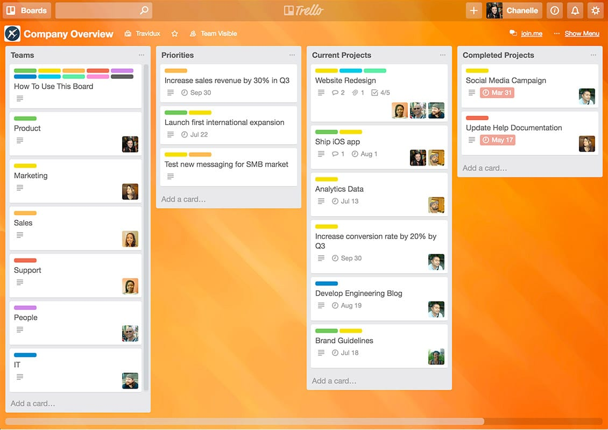  
Quelle: trello.com (02.01.2019)

---

# Board-Automatisierung

- Automatisierung in Github durch Konfiguration von Spalten im Kanban-Board:

- Task-Automatisierung in Jira über "*Workflows*"
- Definiert Verhalten für Tasks bei Status-Änderungen

---

Beispiel eines Workflows in Jira:

---

# Gantt-Diagramm

- **MS-Project** und **Jira** bieten eine Ansicht als "*Gantt-Diagramm*" an

- Schnell viele Informationen ablesbar
- Hier sichtbar: Fortschritt einzelner Tasks und Abhängigkeiten

---

# Task-Filterung in Jira: JQL

- "*Jira Query Language*"
- SQL-Ähnliche Query-Language zum Filtern von Tasks
- Ermöglicht das Erzeugen spezifischer Ansichten

Alle Tasks aus "Musterprojekt", die diese Woche erstellt wurden geordnet nach Zeitpunkt der Erstellung (neuste zuerst)

---

## Multiprojektorganisation

Quelle: Projektorganisation und Management im Software Engineering, Manfred Broy & Marco Kuhrmann (S. 40)

---

# Überblick

Vergleich von Projektmanagementwerkzeugen im Bezug auf Darstellung von Arbeitspaketen

Funktionalität | Github | Gitlab | Trello | Jira | MS-Project
--- | --- | --- | --- | --- | ---
Kanban-Board | ✔ | ✔ | ✔ | ✔ | ✔
Automatisierung | ✔ | 🗙 | 🗙 | ✔ | 🗙
Gantt-Diagramm | 🗙 | 🗙 | 🗙 | ✔ | ✔

---

# Projektinfrastruktur

- passende Werkzeuge
- Team entlasten

Anforderungen definieren für:
- Hardwareumgebung
- Kommunikationsumgebung
- Projektablage

---

## Hardwareumgebung

Hardware für:
- Entwicklung
- Testen
- Produktivbetrieb

---

## Kommunikationsumgebung

Zur Vernetzung gehört:
- Kommunikation im Team
- Druckerzugriff
- zentrale Ablage

---

## Projektablage

Zur Projektablage gehört:
- Dokumente der Projektinitiierung
- Angebote & Verträge
- Planungs- & Steuerdokumente
- Projekttagebuch
- Korrespondenz und Aufzeichnungen
- Aufzeichnungen
  - technische Infrastruktur
  - Administration

---

# Aspekte von Projektinfrastruktur im Bezug auf Projektmanagementwerkzeuge

## Zentrale Datenablage

- Neben FTP / Cloud-Lösungen (Dropbox etc.) wird häufig auf Repositories (Versionsdatenbanken) gesetzt
- Vorteil: Jede Änderung bleibt erhalten
- Repository ist häufig grundlegende Kernkomponente
- Exakte Strukturierung von organisierter Umgang erforderlich

---

# Grundlagen beim Umgang mit Repositories

- **Struktur**: Festgelegte (Verzeichnis)struktur ermöglicht einfaches und schnelles Wiederfinden von Dateien
- **Rechte**: Klare Festlegung, wer Schreib-/Leseberechtigung auf welches Verzeichnis hat (Vermeiden von versehentlichen Änderungen an sensiblen/wichtigen Daten)
- **Bearbeitungsregeln**: Bennenungsregeln, Einschränkungen auf Dateitypen, Festlegung einer Konvention für Check-In-Kommentare / Commit-Messages
- **Verantwortung**: Festlegen einer verantwortlichen Person, die die Einhaltung festgelegter Regeln umsetzt

---

# Repository-Software

- **CVS**: bereits eingestellt, aber weit verbreitet
- **Apache Subversion**: weit verbreitet
- **GIT**: sehr weit verbreitet, dezentral
- **Mercurial**: Vorreiter bei Features wie z.B. Bilden von binären Differenzen
- **Team Foundation Server**: direkte Integration in z.B. MS-Project
- **IBM-Jazz**: weit verbreitet
- **Perforce**: weit verbreitet

Eigenschaft | CVS | Subversion | GIT | Mercurial | Team Foundation Server | IBM Jazz | Perforce
--- | --- | --- | --- | --- | --- | --- | ---
Lizenz | frei | frei | frei | frei | proprietär | proprietär | proprietär
Dezentral | 🗙 | 🗙 | ✔ | ✔ | 🗙 | 🗙 | 🗙

---

# Integration von Projektmanagementwerkzeugen

- Mögliche Anforderung an Projektmanagementwerkzeugen: Integration untereinander
- Bei Integration: Verwaltung von Daten an nur einer Stelle nötig, aber an unterschiedlichen Stellen nutzbar

- **Trello**: sehr mächtige Möglichkeiten zur Integration zu vielen Projektmanagementtools
- **Jira**: Integration von **Github** und **Gitlab** möglich
- **MS-Project**: Zur Integration mit Produkten, die nicht von Microsoft stammen nicht geeignet

- Bei Kommunikation mit **Slack**: Integration aller Tools außer **MS-Project** möglich
	- Benachrichtigungen bei Statusänderungen von Tasks
	- Task-Verwaltung direkt im Messenger

---

# Rollen
- Definition Rolle
- Projekleitung
- Qualitätsmanagement
---

# Teambildung
- fachlich und sozial ausgewogen
- Anerkennung und Vertrauen zum Team
- Zielstellung und Aufgabenverteilung klar
- offene Kommunikationsatmosphäre
- Teamleitung - Zuständige für Einzelaufgaben
- Hierarchisch - Demokratisch
---

# Projekt-/Arbeitsplanung

- Vorgaben der Arbeitsleistung
- Termine
- Ressourcen
- zulässige Kosten

---

## Plantechniken

- Projektstrukturplan
- Meilensteinplan
- Netzplantechnik
- Balkenplantechnik

---

     
.t-big[Vorgehensmodelle]

---

## RUP (Rational Unified Process)
* aktivitätsgetriebener Entwicklungsprozess
* iterativ/inkrementell
* UML unterstützt
* Phasen (eine Iteration)
	- Inception
	- Elaboration
	- Construction
	- Transition

---

---

---

Quelle:  wikipedia.org/wiki/Rational_Unified_Process (04.01.2019)

---

V-Modell XT
* artefaktorientiert
* Tailorring 
* Vorghens- und Ablaufbausteine
* AG / AN
* Rollen
* Management
* iterativ
---

---

Quelle: https://www.microtool.de/wissen-online/wie-funktioniert-das-v-modell-xt (04.01.2019)

---

## Phasenmodell
* Phasenweise
* ein Durchlauf
* Ergebnisse "fließen" in die nächste Phase ein
---

---

## Spiralmodell
* Phasen
    + Analyse
    + Evaluierung
    + Realisierung
    + Planung
* iterativ
* inkrementell
* Prototyping

---

---

## Prototyping
* Modell zur Darstellung
* Breite
* Tiefe
* Arten von Prototypen
	- Demonstratoren
	- Labormuster
	- Pilotsysteme
	- Rapdi Prototyping

---

## Agile Methoden
* codeorientiert  
* dynamisch
* transparent
* schwer vertraglich einzubinden
### Beispiele
* Refactoring
* Pair Programming
* Test-driven Development
* Continous Integration
* Planning Game
---

# Konkrete Vorgehensmodelle
## Scrum
* agiles Vorgehensmodell
* Daily Scrums
### Artefakte
* Product Backlog 
* Sprint Backlog
* Release
### Rollen
* Product Owner
* Scrum Master
* Team

---

Quelle: https://www.integrata.de/leistungsangebot-informationstechnologie/scrum-und-agilitaet/(04.01.2019)

---

     
.t-big[Projektfortschrittskontrolle-/]
.t-big[Steuerung]

---

### Änderungsforderungen und Änderungsentscheidungen

Beispiele für Änderungsforderungen sind:  
- Änderung der Anwenderanforderungen
- Unklarheiten in den Anforderungen oder im Entwurf
- Fehler im Entwurf oder im Softwaresystem
- Nichterfüllung der Anforderungen (fehlende oder fehlerhafte Funktionalität)
- Qualitätsmängel (hinsichtlich Tests, Leistung, Stabilität)
- Optimierungsbedarf oder -optionen (Performance, Skalierbarkeit)

### Konfliktpotenzial

Durch mehrmalige Änderungen kann es leicht zu Konflikten im Team kommen  
Die Arbeitsmoral sinkt, da das Projektteam den Eindruck erweckt, dass es sich nicht lohnt etwas abzuschließen

---

#### Implementation und Test

Systementwurf wird ausprogrammiert  
Ausgangspunkt ist die Systemarchitektur mit Datenmodell und Komponentenspezifikation

- Qualitätsmerkmale des Codes:
  - die Wahl (Namensgebung) für Identifikatoren (Variablen, Klassen etc.)
  - die Vermeidung risikobehafteter Sprachelemente
  - die Dokumentation
  - die Form/Schreibweise/Stil der Codierung

  Vorteile:
  - für die Zukunft, gute Lesbarkeit
  - weniger Fehleranfällig
  - Überprüfbarkeit

---

#### Codedokumentation

Codedokumentation ist wichtiger Bestandteil  
Sollte direkt zum Codier Zeitpunkt erstellt werden

- Spezifikation (formal oder informell) mit
  - Vor- und Nachbedingungen eines Funktionsaufrufs
  - Rolle und Typ von Parametern
  - Fehlerfälle
  - Fehler-/Ausnahmebehandlung
- Angabe der durch eine Funktion aufgerufenen weiteren Funktionen
- Laufzeiten und Speicherbedarf

---

### Integration und Test

kleine Teilprojekte  
keine "Big-Bang-Integration"

- Vorteile:
  - Fehlerlokalisierung ist einfacher, wenn in ein bereits ausgetestetes Teilsystem, ein weiter Teilsystem integriert wird
  - es kann mit einer Integration begonnen werden, wenn Teilsysteme fertig sind

Bei der Integration werden ebenfalls Fehler gefunden, diese zu lokalisieren ist oft schwieriger, da es:
  - Architekturfehler
  - Teilsystem- oder Modulfehler sein können

### Wartung
Die Wartung wird abgetrennt vom Projekt und wird daher auch nicht mehr als Projekt gesehen  
Wird als langfristige und nicht abschätzbare Zeit als Aufgabe gesehen

---

# Aspekte zu Berichtswesen in Projektmanagementwerkzeugen

- Unterstützung von Projektfortschrittskontrolle in Projektmanagementwerkzeugen hat einen variierenden Umfang
- **Trello** hat kein solches Feature
- **Github** / **Gitlab**: Minimalistischer Ansatz: Anzeige des Fortschritts eines Meilensteins

- Umfangreiche Unterstützung von Reporting zur Projektfortschrittskontrolle in dedizierten Projektmanagementwerkzeugen wie **Jira** und **MS-Project**

---

# Berichtseditor in MS-Project

- **MS-Project** bietet mächtigen Berichtseditor
- Gänzliche Freiheit in der Erstellung von Berichten zu diversen Kennzahlen
- Unter Anderem Möglichkeiten zur Visualisierung des Projektfortschritts
- Benutzung erinnert an MS Word

---

# MS-Project: Beispielbericht

- Berücksichtigt Erreichbarkeit von Fristen unter Berücksichtigung von noch nötiger Arbeitszeit im Hinblick auf zugewiesene Ressourcen
- Task gilt als verspätet, obwohl Enddatum in der Zukunft liegt
- Die mögliche Arbeitszeit unterschreitet die noch nötige
- Die Frist des Tasks ist aktuell nicht einhaltbar

---

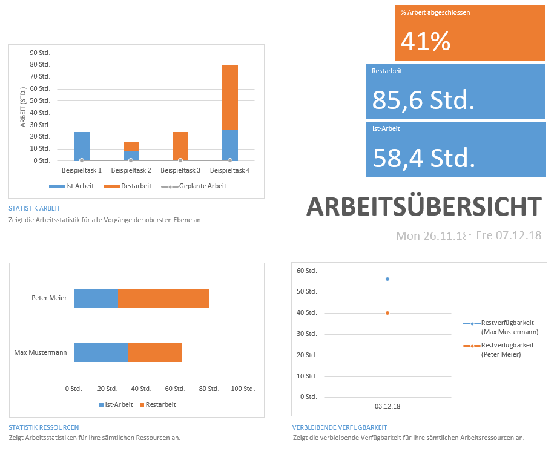

---

# Jira: Reporting

- Sehr mächtige Features zum automatischen generieren von Berichten
- Weniger Freiheiten als bei **MS-Project**, jedoch mächtigere Berichte
- z.B. Berichte zur Bearbeitungsdauer von Tasks (ermöglicht Erkennen von Trends zu Verspätungen)

  
Beispiel: Flussdiagramm in Jira. Sowohl Auslastung als auch Gesamtfortschritt ablesbar

---

### Projektfortschrittskontrolle und Steuerung

Aufrechthaltung der organisatorischen Rahmenbedingungen für das Projekt

### Grundsätzliches zur Fortschrittskontrolle

Wesentliche Aspekte des Projekts werden überwacht und gesteuert  
Lösen von unerwarteten Schwierigkeiten  
Überwachung und Dokumentation des Projektfortschritts  
Einhaltung von Kosten, Terminen und Qualitätsvorgaben  

- regelmäßige Fortschrittsberichte
- regelmäßige Projektbesprechungen
- Überprüfung der Resultate durch Qualitätskontrollmaßnahmen

---

### Prinzipen der Fortschrittskontrolle

- Motivation der Mitarbeiter  
- Vertrauensvolle und offene Gespräche  
- Projektziele und Rahmenbedingungen sollten den Mitarbeitern vorgelegt werden  
- Probleme sollten offen geklärt werden  
- Vorschläge von Mitarbeitern sollten zugelassen werden  
- Überprüfung und Statuskontrolle  

### Projektbesprechungen

Wichtiger Bestandteil  
Projektleiter/Projektteam kriegen den:
- aktuellen Zustand
- die Schwierigkeiten
- Koordinationserfordernisse mitgeteilt  

Die Besprechungen haben auch eine psychologische Bedeutung  
Es wird die Motiviation und Stimmung im Team beeinflusst  
Projektbesprechungen sollten nicht mehr als zwei Ebenen in der Organisationshierarchie betreffen  

---

Ziel dabei ist:
- gegenseitiger Informationstausch
- Identifizierung gemeinsamer Probleme
- Koordination
- Vorbereitung projektspezifischer Entscheidungen

Trotzdem sollten Besprechungen regelmäßig mit dem Projektteam stattfinden  
Hier werden:

- aktuelle Arbeitsaufträge geprüft
- deren Status überprüft
- gegebenenfalls Umplanungen vorgenommen
- eventuell neue Arbeitsaufträge vergeben
- Risiken besprochen

#### Im Agilen Umfeld

Projektbesprechungen sind abhängig von Unternehmens- und Projektkultur  
Als Beispiel bei Scrum gibt es kurze und knappe tägliche Besprechungen "Daily Scrum"

---

### Berichtwesen

Das Berichtswesen ist dafür da um alle auf den gleichen Stand zu bringen  
Dort liegen alle Informationen zum Projekt

- Ergebnisse unabhängiger Kontrollmechanismen
- Termin- und Arbeitspläne
- Ist-Stands des Projekts in Bezug auf die Soll-Vorgaben
- Identifikation von Problemen und der Festlegung von Maßnahmen

Das Berichtwesen sollte folgende Kernfragen beantworten können:  
- Was ist der aktuelle Gesamtprojektstatus?
- Ist das Projekt noch im Kosten-/Zeitplan?
- Was ist der fachliche Fortschritt?
- Was sind aktuelle Problem und Risiken?
- Sind in Zukunft Probleme zu erwarten?

Projektstatusbericht:  
- Meilensteinliste für den Berichtszeitraum
- alle Meilensteine aufgelistet
- nicht erreichen eines Meilenstein muss begründet sein

---

Zur Darstellung bieten sich:

- Einfache Terminlisten an
- Ampelliste für die Kennzeichnung der Nicht-/Erreichung (rot/grün)
- Meilensteintrendanalyse

Auftretende Abweichungen der Planung früh erkennen und behandeln  
Ziel ist es, ob das Projekt:
- im Planungszeitraum liegt  
- von Fehlplanungen oder Umplanungsbedarf betroffen ist  
- Abweichungen hat, diese müssen erfasst, analysiert und dokumentiert werden  

Dient zur Anpassung und zur Optimierung der Planungs- und Schätzmethoden  
Dabei werden eventuelle Projektrisiken entdeckt und müssen berücksichtigt werden  

---

### Soll/-Ist-Vergleich des Aufwands

Im Projekt ist der erfoderliche Aufwand und an diesem Aufwand das Projektbudget gekoppelt  
Überwachung des Aufwands und das Verhältnis vom verbrauchten zu geplanten Aufwands

Aufwandserfassung für ein Soll/-Ist-Vergleich:  
- verbrauchte Zeit erfassen
- dokumentierte geleistete Arbeit der Projektmitarbeiter
- erfasst und ausgewertet, meist in Datenbanken

Nachteil:  
- Erfrassung ist lästig für Mitarbeiter
- Ist selbst wieder mit Aufwand verbunden

### Aufwandskontrolle

Ziel ist es, zu bestimmen:  
- wie viel vom geplanten Aufwand zu einem Zeitpunkt im Projekt fertig wurde
- wie viel noch zur Verfügung steht

Damit werden Symptome und Ursachen ermittelt

---

####Zu hoher Aufwandsverbrauch  

Mögliche Ursachen:

- Unterschätzung des Projektaufwands (Gefährdung von Terminen und Budget)
- Unzureichende Qualität der Mitarbeiter (mangelnde Qualifikation, Motivation, Produktivität)
- Leerlauf der Mitarbeiter durch unklare Aufgabenstellung

### Kostenerfassung und -kontrolle

Die Kostenerfassung erfolgt durch:

  - Tätigkeitsberichte für Personalkosten
  - Kosten für Unteraufträge
  - Interne Berechnung für Materialkosten, Dienstleistungen und ähnliches

---

### Änderungskontrolle

Für den Erfolg des Projekts ist eine sehr konsequent ausgeführte Änderungskontrolle wichtig

Ziele sind die:  
- Arbeitsgrundlagen
- abgenommenen Artefakten

nicht ohne Zustimmung und Wissen zu ändern  
Vermeidung von willkürlich und ausreichend gerechtfertigten Änderungen an gemeinsamen Arbeitsgrundlagen zu vermeiden  

Gegenstand der Änderungskontrolle sind alle Ergebnisse der Entwicklungszyklen, insbesondere:  
- Systemanforderungen
- Architektur- und Schnittstellenfestlegungen
- Komponentenanforderungen
- Testdaten
- Code

Obenen Gegenstände werden zum Ende der Qualitätssicherung gemäß Vorgaben kritisch überprüft  
Bei Änderungen müssen diese von allen der Mitarbeiter genehmigt werden

---

     
.t-big[Qualitätskontrolle-/Steuerung]

---

## Prinzipielles zu Metriken [1 / 2]

Metriken sollten immer einigen dieser Anforderungen genügen:

- Objektivität
- Messgenauigkeit
- Vergleichbarkeit
- Nützlichkeit
---

## Prinzipielles zu Metriken [2 / 2]

---

## Metriken für Produkte

Produktmetriken definieren die Software anhand von Größen wie z.B.:

- Umfang
- Komplexität
- Design
- Performanz
- Qualität

## Metriken für Prozesse

Prozessmetriken drücken die Performanz des Entwicklungsprozesses aus.
Hierbei können bspw. folgende Kennzahlen erfasst werden:

- Zeitbedarf für Fehlerkorrekturen
- Zeitbedarf für Einarbeitung von Änderungen
- Prozessreife

---

## Metriken für Projekte

Projektmertriken beschreiben die Performance des Projekts an sich.
Folgende Kennzahlen ergeben sich bspw.:

- Termintreue 
- Kosten - und Ressourcenverbrauch
- Produktivität

Werden Wertebereiche verlassen, so muss das Management eingreifen uns sofort vereinbarte Steuerungsmaßnahmen einleiten, solche wie:

- Termine
    - Pufferzeiten für Termine
- Kosten
    - Puffer für den Verbrauch des Budgets
- Umfang
    - Abstriche vom vereinbarten Funtionsumfang

Werden diese Puffer überschritten, so muss die nächsthöhere Entscheideungsebene eingreifen, sodass unverzüglich Entscheidungen zur Problemlösung getroffen werden.

---

# Methoden zur Qualitätssicherung

### Reviews

### Tests
---

# Reviews

- Durchführung durch Review-Team
- Diskussion der Ergebnisse in einem Review Meeting
- Gegebenenfalls erneute Überprüfung  
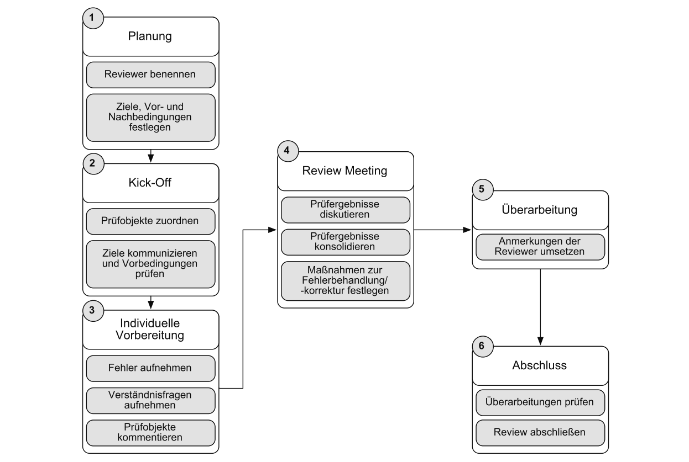

---

# Typen

- **Technisches Review**
  - Finden von Fehlern in technischen Dokumenten wie Architekturdokumente
- **Informelles Review**
  - Technisches Review in informeller Form
- **Inspektion (Walkthrough)**
  - Diskutieren von Fehlern und Lösungsansätzen für grundsätzliche Fehler und Probleme
- **Code Review**
  - Inspektion von einzelnen Code-Ausschnitten
- **Peer Review**
  - Review von Experten, die sich im falle eines **Blind Reviews** nicht kennen oder zuordnen lassen.
- **Audit**
  - Untersuchen vom aktuellen Stand des Projektes von externen Auditoren
---

# Tests

### Statische Codeanalyse

- Automatisches des Quellcodes nach Programmierfehlern
- Beispiel: unerreichbarer Code

### Dynamische Codeanalyse

- Unit Tests
- Programm wird ausgeführt
- Quellcode muss nicht vorliegen

### Formale Analyse- und Beweistechniken
---

# Automatisiertes Testen

- Durch Build-Systeme
- Regelmäßig, z.B. nach jedem Commit

### Testklassen

- Regelablauf
- Fehlerfälle
- Grenzfälle
---

# Reifegradmodelle und Prozessverbesserung

Die Projektfähigkeit ist ein wichtiger Bestandteil zur Einschätzung des Erfolges eines Projekts.  
Um einen nachvollziehbaren Entwicklungsprozess darzustellen, nutzt man Reifegradmodelle.  
Bei Reifegradmodellen geht man davon aus, dass die Prozessqualität Einfluss auf die Produktqualität hat.
---

# Qualität

- Umsetzung der Anforderungen im Projekt
- Probleme:
  - schlecht messbar
  - nicht vergleichbar
- Konkrete Kriterien notwendig

---

## Der kontinuierliche Verbesserungsprozess [1 / 2]

Der kontinuierliche Verbesserungsprozess (KVP) ist die Grundlage für die meisten Prozessverbesserungsprogramme.  
Der KVP zielt darauf ab, eine Verbesserung in kleinen aber stetigen Schritten vorzunehmen.

- Wird unerlässlich, da KVP schließlich Hauptbestandteil eines Unternehmens ist

- Der KVP basiert auf dem sog. "Demingkreis", auch "PDCA-Zyklus" genannt

Die Bedeutung sieht wie folgt aus:

- **P**lan
    - Hier wird ein potenziell Verbesserungswürdiger Prozess untersucht und ein passendes Konzept entwickelt
- **D**o
    - Das Konzept wird wie ein Prototyp erst nur grob umgesetzt
- **C**heck
    - Der Prototyp wird evaluiert. Ist diese positiv, wird der Prozess für die Kompletteinführung freigegeben
- **A**ct
    - Der Prozess wird nun breiter eingeführt und weiterhin bewacht.

---

## Der kontinuierliche Verbesserungsprozess [2 / 2]

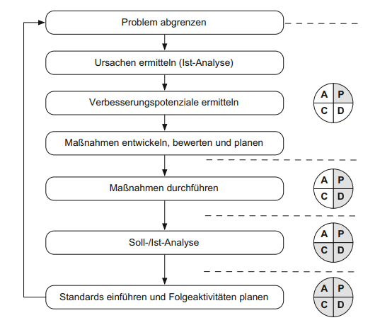

---

## CMMI

Das Softwarereifegradmodell CMMI (Capability Maturity Model Integration) ist eine etablierte Methode um die Fähigkeit eines Unternehmens in Hinsicht Software zu entwickeln zu bewerten.

- Realisiert durch Fragebögen und Interviews bezüglich der Softwareentwicklung
- Hauptzweck ist es, Prozesse zu bewerten und Schwächen aufzudecken

### Bestandteile des Reifegradmodells CMMI

CMMI setzt sich aus den Bestandteilen Prozessgebiete, Fähigkeitsgrad und Reifegrade zusammen.

---

## Fähigkeitsgrade

Bezeichnet den Grad der Institutionalisierung eines Prozessgebiets, also ob Aufgabe definiert und auch aktiver Teil der Arbeit sind.

Hierbei gibt es vier Fähigkeitsgrade:

- Grad 0 (unvollständig)
    - Gibt ein Vorgehen an, welches nur teilweise oder noch gar nicht definiert ist
- Grad 1 (durchgeführt)
    - Bezeichnet einen Prozess, welcher alle Zielstellungen erfüllt
- Grad 2 (geführt)
    - Bezeichnet einen Prozess, der nach Leitlinien durchgeführt wird und dem alle Stakeholder integriert sind
- Grad 3 (definiert)
    - Ein Prozess wird ähnlich wie in Grad 2 kontrolliert durchgeführt. Zusätzlich wird dieser durch ein Tailoring aus einem Standardprozess abgeleitet
    
---

## Reifegrade

Reifegrade bestimmen die Leistungen des Unternehmen selbt.

CMMI differenziert hierbei in fünf Reifegrade:

- Level 1 (ungeregelt)
    - Keine Vorgaben und Anforderung an die Entwicklung und Organisation
- Level 2 (geordnet)
    - Grundsätze sind etabliert und die Arbeit wird so angegangen, dass auch weitere Projekte erfolgreich geführt werden können
- Level 3 (standardisiert)
    - Zusätzlich ein festes Vorgehen in Projekten, bspw. eine Basis eines Standardprozesses
- Level 4 (organisiert)
    - Zusätzlich wird die Projektperformanz der Projekte gemessen
- Level 5 (optimierend)
    - Zusätzlich wird die Arbeit auf Basis von Messungen und Metriken durchgehend optimiert
---

## Weitere Ansätze zur Prozessverbesserung [1 / 3]

### ISO 9000'er Serie

Das ISO-9000 Normenwerk legt einen organisatorischen Rahmen für die Qualitätamanagementsysteme und Qualitätssicherung fest.
Unternehmen können sich hierbei normalerweise nach ISO 9000 zertifizieren lassen.
---

## Weitere Ansätze zur Prozessverbesserung [2 / 3]

### SPICE

SPICE (Software Process Improvement and Capability Determination) ist eine weitere Möglichkeit, den Reifegrad zu bestimmen.

Wie auch bei CMMI gibt es Reifegradstufen

- Stufe 0 (unvollständig)
    - Prozess noch nicht umgesetzt
- Stufe 1 (durchgeführt)
    - Prozess erfüllt an sich seinen Zweck
- Stufe 2 (gesteuert)
    - Prozess wird ausreichend geplant, überwacht und gesteuert und eine Qualitätssicherung wurde etabliert
- Stufe 3 (etabliert)
    - Projekte nutzen ein etabliertes Standardvorgehensmodell welches angepasst werden kann
- Stufe 4 (vorhersagbar)
    - Gibt an, dass Prozesse gemessen werden können, um die Prozessleistung zu bestimmen
- Stufe 5 (optimierend)
    - Hier werden durchgehende Prozessverbesserungen vorgenommen
---

## Weitere Ansätze zur Prozessverbesserung [3 / 3]

### Six Sigma

Six Sigma ist eine statische Methode zur Messung, Analyse und Verbesserung von Geschäftsprozessen.  
Hauptsächlich ist die Erreichung von Zielen die auf Basis von Kennzahlen der Unternehmen und auf Basis von Kundenwünschen definiert.  
Kernprozess ist der "DMAIC"-Zyklus (Define – Measure – Analyze – Improve – Control).
---

# Qualitätsmerkmale für Software

- Funktionalität
- Zuverlässigkeit
- Testbarkeit
- Effizienz
- Benutzbarkeit
- Wartbarkeit
- Änderbarkeit
---

### Qualitätssicherung/-kontrolle

Muss zu jedem Abschnitt eines Projekts etabliert werden

Systemfehler Ursachen:
- Fehler in der Entwicklung (Spezifikation, Entwurf, Programmierung)
- Fehler in den Daten, den Nachrichten oder in den Parametern
- Fehler in Algorithmen (Überlauf der Arithmetik, Speicherüberlauf)
- Geräte- und Hardwarefehler
- Inkonsistenzen in der Konfiguration

Die Aufgabe der Qualitätssicherung ist die berücksichtigung aller möglichen Systemfehler  
Frühstens zu lokalisieren und zu dokumentieren

konstruktive Qualitätssicherung
  - systematische und vorausschauende Entwicklungsschritte sicherstellt
analytische Qualitätssicherung
  - die nach Fertigstellung das (Teil-)Ergebnis eines Entwicklungsabschnitts auf seine Qualität überprüft

---

#### Fehlermodelle

Welche Fehler können auftreten und wie sie sich auswirken und abgefangen werden können  
Fehlermodelle sind Teil der Spezifikation und des Entwurfs

#### Fehlermanagment

Einzelaufgaben die in der Projektdefinition festgelegt und in der Projektdurchführung umgesetzt werden:

- Verfahren zur Erfassung von Fehlern und zur Erstellung von Fehlermeldungen
- Filterung der Fehlermeldungen
  - Fehler klassifizieren
- Fehlerlokalisierung (Diagnose)
  - exakte Beschreibungen
- Vorläufige (provisorische) Fehlerkorrekturen (Patches)
- Endgültige Fehlerkorrekturen
- Umsetzen der Fehlerbehebungskontrolle inklusive einer Fehlerstat

---

# Metriken und Messung

Hierbei gibt es eine allgemeine Bewertung und Verbesserung des Standes, der Qualität usw. für ein zukünftig besseres Zusammenarbeiten untereinander.

Zur Beurteilung ist es wichtig, Kennzahlen und Maßfunktionen (Metriken) einzuführen. In der Softwarentwicklung sind es überwiegend analoge Kennzahlen, die es erlauben, die Qualität und Leisungsfähigkeit eines Produkts sowie des dazugehörigen Entwicklungsteams zu messen.
---

## Sichten auf Metriken

Metriken bestimmen bestimme Eigenschaften einer Software bzw. eines Einwicklungsprozesses im Hinblick darauf, ob diese Erfüllt werden. Diese kommen entweder von dem Kunden oder dem Management selbt.
Die wesentlichen Sichten auf Software und Softwareprozesse sind wie folgt:

- Managementsicht
- Entwicklersicht
- Kundensicht

Für jede Sicht gibt es eine bestimme Menge an Metriken, welche aber eines gemeinsam haben: Sie bilden eine Eigenschaft im Sinne einer Messbaren Größe auf eine Zahl ab.

---

## Messbare Merkmale von Software und Softwareprozessen

Die Hauptaufgabe von Metriken ist es, Eigenschaften von Projekten sichtbar, vergleichbar und veranschaulich darzustellen.

Typische Eigenschaften sind:

- Umfang und Leistung
- Effizienz
- Qualität

Typische Kennzahlen für Entwicklungsprozesse sind:

- Produktivität
- Kommunikationsintensität
- Termintreue
---

## Aussagekraft von Metriken am Beispiel LOC

In der Regel lassen Programmiertechnische Aufgabenstellungen in sehr verschiedenen Arten und Längen lösen.
Hierbei betrachtet man nicht nur die LOC (Lines of Code) sondern auch die Komplexität dieser. So ist es unausreichend nur die Länge zu betrachten und die Aussagekraft anhand dieser zu bestimmen.

## Metriken als Basis für die Messung der Produktivität

Eine geschickte Methode zur Messung des Leistungsumfang liefert die "Function Point Methode".
Hierbei wird der Umfang durch Ermittlung funktionsspezifischer Kennzahlen bestimmt. Hier werden zwar nur ungefähre Ergebnisse, aber diese genügen meistens dem Anspruch.
---

     
.t-big[Projektabschluss]

---

# Projektabschluss

Das Projekt abzuschließen ist Aufgabe des Managements. Dies ist rechtzeitig zu planen und ist unerlässlicher Teil des Gesamtprojekts.

Der Projektabschluss an sich staffelt sich in zwei Subkategorien:

- Projektabnahme
    - Dient der formalen Akzeptanz der Ergebnisse durch den Auftraggeber
- Projektabschluss
    - Dient dazu etwaige Aufräumarbeiten durchzuführen sowie das Projekt formal als beendet zu erklären

Zudem gibt es zwei Arten des Projektabschlusses:

- ordentlich
    - Ist die wünschenswerte Variante, sprich es wird alles in geforderter Zeit ohne größere Probleme beendet
- außerordentlich
    - Ist die Variante, wenn die Rahmenbedingungen nicht in gegebener Zeit erreicht werden konnten
    - Möglicherweise spricht man hier auch von einem Projektabbruch

---

## Visualisierung : Projektabschluss

  
Quelle: Manfred Broy & Marco Kurhmann - Projektorganisation und Management im Software Engineering

---

## Abnahmeverfahren

Es gibt verschiedene Fragen bzgl. der Abnahmeprozeduren:

- Wer ist zur Abnahme befugt?
- Abnahme formal oder still?
- Abnahmeperiode oder Korrekturperiode?
- Komplettabnahme oder Teilabnahme?
- Inhalt und Format des Abnahmedokuments

Das Verfahren muss im vorhinaus von allen festgelegt und akzeptiert worden sein und sollte weiträumig auch im Vertrag definiert sein.

---

## Aufgaben in der Abnahme

Es gibt grob drei Arten von Abnahmeprüfungen:

- Prüfung auf Vollständigkeit der Lieferung
- Verifikation der Projektergebnisse
- Prüfung auf Erfüllung der Anforderungen

## Voraussetzungen für die Abnahme

Grundsätzlich sind die folgenden Maßnahmen zu treffen:

- Durchführen einer Verifikation vor der Lieferung 
- Prüfkriterien festlegen
- Abnahmekriterien festlegen
- Prüfverfahren festlegen

---

## Probleme und Fehler in der Abnahme

Mögliche Probleme sind:

- Auftreten von Fehlern bei der Abnahme
    - Um dies zu vermeiden, sollte man so früh wie möglich mit dem Testen der Software beginnen
- Verzögerung der Abnahme
    - Um dies zu vermeiden, sollte man in der Abnahmeprozedur Fristen vereinbaren, nach deren Ablauf die Lieferung als abgenommen gilt
- Verweigerung der Abnahme
    - Hierbei ist es ratsam sich korrekt mit dem Arbeitgeber zu verständigen um keine unerwünschte Software zu übergeben
- Abnahme mit Auflagen
    - Ebenfalls sollte man mit dem Arbeitgeber korrespondieren, um direkt etwaige Softwarelücken zu umgehen
    

---

## Aufgaben im Projektabschluss

Es gibt hierbei zwei Arbeitsphasen:

- Aufräumen der Projektinfrastruktur
- Sichern des gesammleten Wissens

#### Aufräumen 

Definiert ua. die Abschlusskalkulation im Rahmen der Abrechnung. Dabei werden auch Projektdaten wie Dauer, Kosten, Aufwand etc. verglichen und analysiert.

#### Wissen sichern

Erfahrungen aus einem Projekt, welche sich während des Projekts entwickelt und bewährt haben, werden gesichert.  
Nicht bewährte Methoden werden ebenfalls gesichert, sodass diese Fehler nicht erneut begangen werden.

---

## Projektabschlussbericht

Der Abschluss muss dokumentiert werden. Die Vorgaben dafür werden normalerweise vorher besprochen.
Das V-Modell XT sieht folgende Gliederung vor:

1. Managementübersicht
2. Ausgangslage und Ziele
3. Projektergebnisse
4. Qualitätsbewertung
5. Projektverlauf
---

## Organisation des Projektabschlusses

#### Interner Projektabschluss
Der interne Abschluss dient der Besprechung sowie dem Aufräumen.
#### Großer Projektabschluss
Der große Abschluss findet mit dem Kunden statt, um das Projekt zunächst formal zu beenden. Dabei gibt es ggf. Abschlusspräsentationen und möglicherweise sogar Festveranstaltungen.
